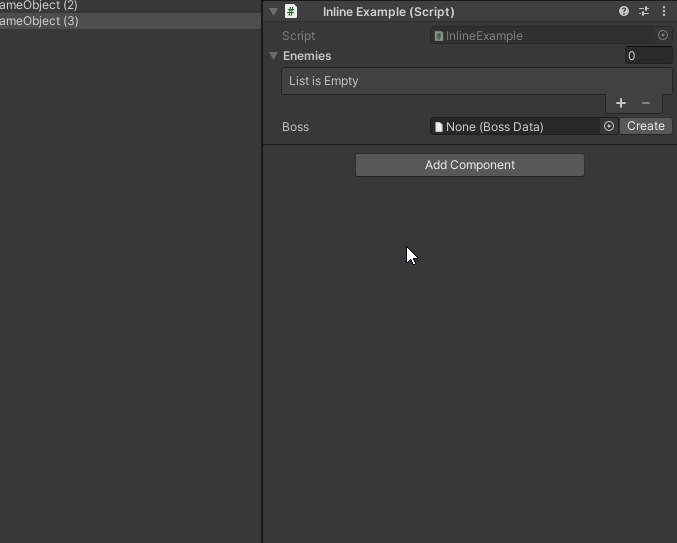
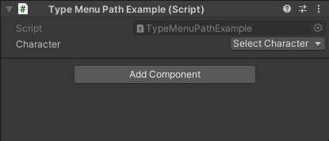

# Gadget: Inspector Essentials for Unity

Gadget is package containing a handful of useful and stackable Unity Inspector attributes.

The goal of Gadget is to make Unity game development more fun.

## Installation

Install via Git URL by declaring the package in your manifest.json file.

```
"io.savolainen.gadget.core": "https://github.com/jonisavo/gadget.git#latest"
```

## Attributes

### `[Inline]`

_Based on work by Garett Bass and contributors, see [UnityExtensions.InspectInline](https://github.com/garettbass/UnityExtensions.InspectInline)._

Allows viewing `UnityEngine.Object` in an inline editor, and creating new `ScriptableObject`
and `Material` assets.



```c#
[CreateAssetMenu(fileName = "EnemyData", menuName = "Enemy Data")]
public class EnemyData : ScriptableObject
{
    public string name;
    public int healthPoints;
}

[CreateAssetMenu(fileName = "BossData", menuName = "Boss Data")]
public class BossData : EnemyData
{
    public AudioClip theme;
    [Inline]
    public EnemyData[] henchmen;
}

[Inline]
public EnemyData[] enemies;

[Inline]
public BossData boss;
```

### `[ReferenceTypeSelector]`

Choose the type of a `SerializeReference` field.


```c#
[Serializable]
public abstract class Character
{
    public string name;
    public abstract void Attack();
}

[Serializable]
public class Swordsman : Character
{
    public float strength;
    public override void Attack() { /* ... */ }
}

[Serializable]
public class Orc : Character
{
    public float scariness;
    public override void Attack() { /* ... */ }
}

public interface IEvent
{
    public void Trigger();
}

[Serializable]
public struct ScreenFadeEvent : IEvent
{
    public Gradient fadeGradient;
    public AnimationCurve fadeCurve;
    public void Trigger() {}
}

[Serializable]
public struct PlayerDamageEvent : IEvent
{
    public float damageAmount;
    public void Trigger() {}
}

[SerializeReference, ReferenceTypeSelector]
public Character character;

[SerializeReference, ReferenceTypeSelector]
public IEvent[] events;
```

### `[TypeMenuPath]`
#### For classes and structs

Specify the type menu path used with `[Inline]` and `[ReferenceTypeSelector]`.



```c#
[TypeMenuPath("Heroes/Swordsman")]
public class Swordsman : Character { /* ... */ }
    
[TypeMenuPath("Heroes/Thief")]
public class Thief : Character { /* ... */ }

[TypeMenuPath("Enemies/Orc")]
public class Orc : Character { /* ... */ }

[TypeMenuPath("Enemies/Bosses/Evil King")]
public class EvilKing : Character { /* ... */ }
```

### `[EnableIf]`

Enables the field if the given member resolves to `true`.
The member can be a field or a method. Visibility is ignored.

A member name prefixed with `!` has an inverse effect.

```c#
public bool followPlayer;

[EnableIf("followPlayer")]
public Transform playerPosition;

[EnableIf("!followPlayer")
public bool goShopping;

public bool IsActive => gameObject.activeInHierarchy;

private static bool IsHappyHour()
{
    var hour = DateTime.Now.Hour;
    return hour == 21 || hour == 22;   
}

[EnableIf("IsHappyHour")]
public bool happyHourBooleanField;
```

### `[ShowIf]`

Makes the field visible if the given member resolves to `true`.
The member can be a field or a method. Visibility is ignored.

A member name prefixed with `!` has an inverse effect.

```c#
public bool enableDebugMode;

[ShowIf("enableDebugMode")]
public bool invincibility;

[ShowIf("!enableDebugMode")
public bool enforceSecurity;

public bool IsActive => gameObject.activeInHierarchy;

[ShowIf("!IsActive")]
public string IAmHidden = "I am hidden most of the time :)";

private bool _angry;

[SerializeField, ShowIf("_angry")]
private int _angerLevel;
```

### `[Disabled]`

Disables the field. Useful for debugging values.

```c#
[SerializeField, Disabled]
private Vector3 _currentPosition;
```

## Unity attribute replacements

Gadget comes with replacements for Unity's built-in attributes to
enable stacking them. Some even have additional features.

### `[GadgetContextMenuItem]`

A stackable version of Unity's `[ContextMenuItem]`.

Additional feature: if a single string is passed to the constructor,
it is used for the function and the context menu item.

```c#
[GadgetContextMenuItem("Reset")]
public Vector3 position;

private void Reset()
{
    position = Vector3.zero;
}
```

Additional feature: supports functions with a parameter.

```c#
[GadgetContextMenuItem("Print")]
[GadgetContextMenuItem("PrintTypeOfObject", "Print Type")]
public string name;

private void Print(string str)
{
    Debug.Log(str);
}

private void PrintTypeOfObject(object obj)
{
    Debug.Log(obj.GetType());
}
```

### `[GadgetColorUsage]`

A stackable version of Unity's `[ColorUsage]`.

Additional feature: has `ShowAlpha` and `HDR` properties for configuring the
attribute without boolean arguments.

```c#
[GadgetColorUsage(ShowAlpha = false, HDR = true)]
public Color myColor;
```

Additional feature: allows hiding the eye dropper tool.

```c#
[GadgetColorUsage(ShowEyedropper = false)]
public Color myColor;
```

### `[GadgetGradientUsage]`

A stackable version of Unity's `[GradientUsage]`.

Additional feature: has additional `ColorSpace` and `HDR` properties for
configuring the attribute without boolean arguments.

```c#
[GadgetGradientUsage(ColorSpace = ColorSpace.Linear, HDR = true)]
public Gradient myGradient;
```

### `[GadgetMultiline]`

A stackable version of Unity's `[Multiline]`.

Additional feature: has a `Lines` property for configuring the attribute
without an integer argument.

```c#
[GadgetMultiline(Lines = 5)]
public string messageWithFiveLines;
```

### `[GadgetRange]`

A stackable version of Unity's `[Range]`.

### `[GadgetMin]`

A stackable version of Unity's `[Min]`.

### `[GadgetTooltip]`

A stackable version of Unity's `[Tooltip]`.

### `[GadgetDelayed]`

A stackable version of Unity's `[Delayed]`.

### Combination

All attributes defined by Gadget can be combined.

```c#
private static bool IsHappyHour()
{
    int hour = DateTime.Now.Hour;
    return hour >= 20 && hour <= 23;
}

public bool enableDebugMode;

[ShowIf("IsHappyHour"), EnableIf("enableDebugMode"), GadgetTooltip("Shh!")]
public bool happyHourSecretField;
```

## Creating an extension

### GadgetPropertyAttribute

To create your own extension, you need an attribute class that inherits
from `GadgetPropertyAttribute`.

```c#
public class MyCoolModifierAttribute : GadgetPropertyAttribute
{
    /* ... */
}
```

### GadgetDrawerExtension

Create a new `GadgetDrawerExtension` with a `GadgetExtensionFor` attribute pointing
to your property attribute type.

```c#
[GadgetExtensionFor(typeof(MyCoolModifierAttribute))]
public class MyCoolModifierDrawerExtension : GadgetDrawerExtension
{
    /* ... */
}
```

The class has three protected properties:
- `Attribute`: the `GadgetPropertyAttribute` the extension is drawing
- `Label`: the `GUIContent` label used for the field
- `FieldInfo`: the `FieldInfo` of the field 

You can override the following virtual methods:

#### OnPreGUI

```c#
public override void OnPreGUI(Rect position, SerializedProperty property)
{
    /* ... */
}
```

Called before drawing the actual property field.
`OnPreGUI` is called for each extension in the order they are defined in.

```c#
[A] [B] [C]
public float field;
```

The extension for `A` is first, then `B`, then `C`.

#### OnPostGUI

```c#
public override void OnPostGUI(Rect position, SerializedProperty property)
{
    /* ... */
}
```

Called after drawing the actual property field.
`OnPostGUI` is called for each extension in the reverse order.

```c#
[A] [B] [C]
public float field;
```

The method for `C` is called first, then `B`, then `A`.

#### TryOverrideMainGUI

```c#
public override bool TryOverrideMainGUI(Rect position, SerializedProperty property)
{
    /* ... */
}
```

By default, `EditorGUI.PropertyField` is used to draw the property. Extensions have
the opportunity to override this behaviour with `TryOverrideMainGUI`.

Only one extension is able to override the main GUI.

##### Example

```c#
public override bool TryOverrideMainGUI(Rect position, SerializedProperty property)
{
    if (!PropertyIsValid(property))
        return false;
        
    /* ... */
        
    return true;
}

private static bool PropertyIsValid(SerializedProperty property)
{
    return property.propertyType == SerializedPropertyType.Integer;
}
```

#### TryOverrideHeight

```c#
public override bool TryOverrideHeight(SerializedProperty property, GUIContent label, out float newHeight)
{
    /* ... */
}
```

Used in conjuction with `TryOverrideMainGUI`. The method should output the new height if
the extension wishes to override the property height.

Only one extension is able to override the property height.

##### Example

```c#
public override bool TryOverrideHeight(SerializedProperty property, GUIContent label, out float newHeight)
{
    newHeight = 0f;

    if (!PropertyIsValid(property))
        return false;

    newHeight = /* ... */
    
    return true;
}
```

#### IsVisible

```c#
public override bool IsVisible(SerializedProperty property)
{
    /* ... */
}
```

If the method returns `false`, the property will not be drawn.

#### IsEnabled

```c#
public override bool IsEnabled(SerializedProperty property)
{
    
}
```

If the method returns `false`, the property will be disabled.

#### IsInvalid

```c#
public override bool IsInvalid(SerializedProperty property, out string errorMessage)
{
    /* ... */
}
```

If the method returns `true`, the property is invalid and an error message will
be shown in the inspector with the `errorMessage` set inside the method.

##### Example

```c#
public override bool IsInvalid(SerializedProperty property, out string errorMessage)
{
    errorMessage = "Field is not an integer";
    return property.propertyType != SerializedPropertyType.Integer;
}
```

#### CanCacheInspectorGUI

```c#
public override bool CanCacheInspectorGUI(SerializedProperty property)
{
    /* ... */
}
```

If the method returns `false`, the GUI will not be cached.
