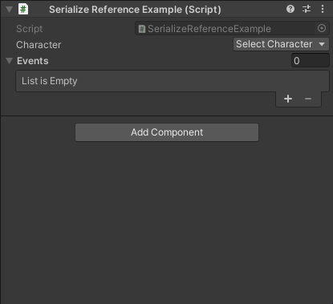

# Gadget: Inspector Essentials for Unity

Gadget is package containing a handful of useful Unity Inspector attributes which can be stacked.

Gadget comes with the `GadgetPropertyAttribute` and `GadgetDrawerExtension` classes which when combined, allow for stacking property drawers.

Gadget also includes additional attributes for making Unity game development more fun.

## Installation

Install via Git URL by declaring the package in your manifest.json file.

TODO

## Attributes

### `[Inline]`

_Based on work by Garett Bass and contributors, see [UnityExtensions.InspectInline](https://github.com/garettbass/UnityExtensions.InspectInline)._

Allows viewing `UnityEngine.Object` in an inline editor, and creating new `ScriptableObject`
and `Material` assets.


```c#
[CreateAssetMenu(fileName = "EnemyData", menuName = "Enemy Data")]
public class EnemyData : ScriptableObject
{
    public string name;
    public int healthPoints;
}

[CreateAssetMenu(fileName = "BossData", menuName = "Boss Data")]
public class BossData : EnemyData
{
    public AudioClip theme;
    [Inline]
    public EnemyData[] henchmen;
}

[Inline]
public EnemyData[] enemies;

[Inline]
public BossData boss;
```

### `[ReferenceTypeSelector]`

Choose the type of a `SerializeReference` field.



```c#
[Serializable]
public abstract class Character
{
    public string name;
    public abstract void Attack();
}

[Serializable]
public class Swordsman : Character
{
    public float strength;
    public override void Attack() { /* ... */ }
}

[Serializable]
public class Orc : Character
{
    public float scariness;
    public override void Attack() { /* ... */ }
}

public interface IEvent
{
    public void Trigger();
}

[Serializable]
public struct ScreenFadeEvent : IEvent
{
    public Gradient fadeGradient;
    public AnimationCurve fadeCurve;
    public void Trigger() {}
}

[Serializable]
public struct PlayerDamageEvent : IEvent
{
    public float damageAmount;
    public void Trigger() {}
}

[SerializeReference, ReferenceTypeSelector]
public Character character;

[SerializeReference, ReferenceTypeSelector]
public IEvent[] events;
```

### `[TypeMenuPath]`
#### For classes and structs

Specify the type menu path used with `[Inline]` and `[ReferenceTypeSelector]`.


```c#
[TypeMenuPath("Heroes/Swordsman")]
public class Swordsman : Character { /* ... */ }
    
[TypeMenuPath("Heroes/Thief")]
public class Thief : Character { /* ... */ }

[TypeMenuPath("Enemies/Orc")]
public class Orc : Character { /* ... */ }

[TypeMenuPath("Enemies/Bosses/Evil King")]
public class EvilKing : Character { /* ... */ }
```

### `[EnableIf]`

TODO

### `[ShowIf]`

TODO

### `[Disabled]`

Disables the field. Useful for debugging values.

```c#
[SerializeField, Disabled]
private Vector3 _currentPosition;
```

## Unity attribute replacements

Gadget comes with replacements for Unity's built-in attributes to
enable stacking them. Some even have additional features.

### `[GadgetContextMenuItem]`

A stackable version of Unity's `[ContextMenuItem]`.

Additional feature: if a single string is passed to the constructor,
it is used for the function and the context menu item.

```c#
[GadgetContextMenuItem("Reset")]
public Vector3 position;

private void Reset()
{
    position = Vector3.zero;
}
```

Additional feature: supports functions with a parameter.

```c#
[GadgetContextMenuItem("Print")]
[GadgetContextMenuItem("PrintTypeOfObject", "Print Type")]
public string name;

private void Print(string str)
{
    Debug.Log(str);
}

private void PrintTypeOfObject(object obj)
{
    Debug.Log(obj.GetType());
}
```

### `[GadgetColorUsage]`

A stackable version of Unity's `[ColorUsage]`.

Additional feature: has `ShowAlpha` and `HDR` properties for configuring the
attribute without boolean arguments.

```c#
[GadgetColorUsage(ShowAlpha = false, HDR = true)]
public Color myColor;
```

Additional feature: allows hiding the eye dropper tool.

```c#
[GadgetColorUsage(ShowEyedropper = false)]
public Color myColor;
```

### `[GadgetGradientUsage]`

A stackable version of Unity's `[GradientUsage]`.

Additional feature: has additional `ColorSpace` and `HDR` properties for
configuring the attribute without boolean arguments.

```c#
[GadgetGradientUsage(ColorSpace = ColorSpace.Linear, HDR = true)]
public Gradient myGradient;
```

### `[GadgetMultiline]`

A stackable version of Unity's `[Multiline]`.

Additional feature: has a `Lines` property for configuring the attribute
without an integer argument.

```c#
[GadgetMultiline(Lines = 5)]
public string messageWithFiveLines;
```

### `[GadgetRange]`

A stackable version of Unity's `[Range]`.

### `[GadgetMin]`

A stackable version of Unity's `[Min]`.

### `[GadgetTooltip]`

A stackable version of Unity's `[Tooltip]`.

### `[GadgetDelayed]`

A stackable version of Unity's `[Delayed]`.

### Combination

All attributes defined by Gadget can be combined.

```c#
private static bool IsHappyHour()
{
    int hour = DateTime.Now.Hour;
    return hour >= 20 && hour <= 23;
}

public bool enableDebugMode;

[ShowIf("IsHappyHour"), EnableIf("enableDebugMode"), GadgetTooltip("Shh!")]
public bool happyHourSecretField;
```

## Attribute drawer extensions

TODO